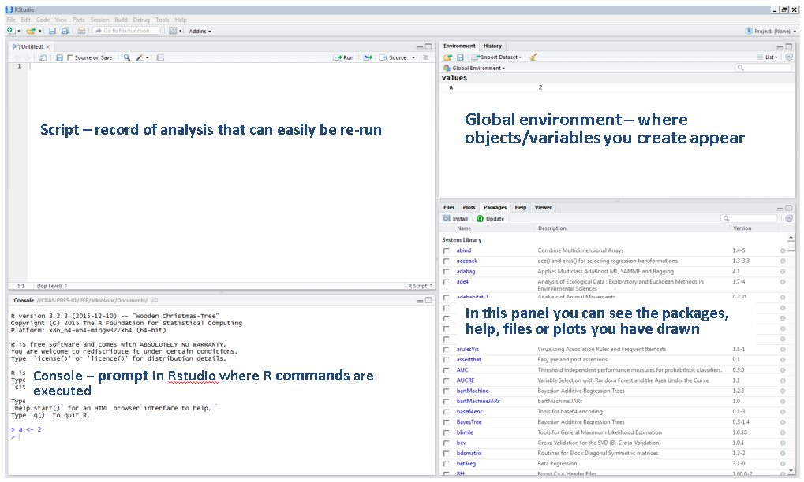

``` {css, echo=FALSE}
.fillblank {
  background-color: #98ccff;
}
```

# <span style="color:#2A5098"> 0.Course Overview</span>

* **Who we're doing this for:**
    + Beginners who have heard about R and would like some help to get started
    + SASperts who would like to learn R to get the best of R's extra functionality without learning about things they won't need
    + Managers who may not end up coding, but want to know the basics of what their team will be working with
    + Anyone else!  

* **What we're covering:**
    +  Basics of RStudio and R
    +  Data types in R
    +  Installing packages
    +  Importing and manipulating data
    +  Creating graphs
    + Understand a few applications of the potentials of R
    + Know where to go next to carry on learning and become an R wizard
   

* **What we're not covering:**
    + How to create a Shiny App
    + Anything hard/advanced: Loops/iterative processing

    
    
**We are not trying to do a full R course that replicates the content readily available on the internet. This course tries to get you up and running  quickly to kick-start your R journey.**

```Note: If you see a box like this, please type along```

----------------------------------------------

# <span style="color:#2A5098">1. Introduction </span>

### What is R and why use it?

R is a statistical programming language. It is set up to be really simple for traditional statistics uses like running time series analysis. but its other key strength is that it is open source and has lots of free bolt on packages that let you do complex things in just a few lines of code.

R can be used for data manipulation, exploration, modelling, reproducible reporting, implementing algorithms, static and interactive visualization. It is one of the leading programming languages in Data Science. 

- [Create beautiful charts](https://www.r-graph-gallery.com/all-graphs/)
- [Do network visualisation and analysis](http://kateto.net/networks-r-igraph)
- [Access to advanced machine learning algorithms](https://kai-data-exploitation.github.io/R-selflearn-guide/guide.html#making_predictions)
- [Create maps](https://rmarkdown.rstudio.com/gallery.html)
- [Create dashboards and interactive charts](https://rmarkdown.rstudio.com/gallery.html)
- [Reproducible analytical pipelines (great for Official Statistics)](https://kai-data-exploitation.github.io/ns-employment-allowance/empall_spine.html)


Open-source means that is free to use and anyone can help build new packages. This has led to a large amount of information, tutorials and help pages being available on the internet. There is a strong community of people involved in the development of R and an annual R conference in London (EARL).

**Things to watch out for/comparisons to other languages/environments**

* We use R in RStudio software. It is mostly code based instead of using a visual interface
* R is case sensitive (but the auto complete coding helps)
* R is typically used on data that can fit into RAM (but there are workaround packages)
* Getting data into R:
- R has packages which allow you to interact with databases. Please contact your database/IT team to see which databases in your area can be connected with R. Note that these packages often need you to know SQL syntax. However if you use *dbplyr* you can write R syntax which is converted into SQL. 
- If you wish to take data from other locations R is able to read many types of datafile (including Excel, JSON and SAS data files) and can access data saved in shared folders.


----------------------------------------------


# <span style="color:#2A5098">2. R Studio</span>

When you open R Studio you should get something which looks like the image below. You may only have three screens however so the first thing to do is open a new script File -> New File -> R Script.

The image below explains what each of the screens is for:
```{r console,echo=FALSE, out.width = "700px"}

```

**Projects**

To keep all of our work together today we will create a Project. A project sets up a new folder for your work so you can store all your code and data in one place.

To do this go to File -> New Project -> New Directory -> New Project
and name it `intro_to_R`


If you are copying across file paths from windows file explorer, you need to flip your slashes from `\` to `/` and from `\\` to `//`.


**Adding comments**  

Commenting your code is really important especially for QA. Try and include comments explaining why you are doing something rather than what.  
To add a comment use the `#` symbol or to apply it to a block of code use `ctrl+shift+c`.


**Running a line of code**  

In a script code does not automatically run until you tell R Studio you are ready. You can either highlight the code or place your cursor on the line and press Run at the top of the script or press `ctrl+return`.

Your script is passed to the console to run it. You can also type code directly into the console if you don't want it recording in your code.  

`>` is the command prompt where you type your code. A stop sign shows that your code is running.  

`+` means the submitted code was incomplete. You can either submit the remaining code or press "stop" to return to the command prompt

**Section breaks**

Section breaks are a good way to organise your code. We suggest you include one for each new chapter of the course. Pressing `ctrl+shift+r` is the quickest way to put them in.

```{r section_break}
# Add a section break -----------------------------------------------------------
```
**Helpbox**

In the bottom right panel you can search for help as you go. This is great for working out which arguments your function needs and usually includes example code segments at the bottom of the help page.

**Saving the environment**

Whilst this is good for the polar bears, in R Studio it is generally not a good idea. It saves everything you have done in the previous R Studio session which could include manipulations to the data which you have forgotten about. It is best to re-run the analysis from the start each time.


----------------------------------------------

# <span style="color:#2A5098">3. Data Types/ Data Structures</span>
### Maths
```{r addition}
# Addition
3 + 1
```

Type the line of code above and run that line.

The key numeric operators in R are:

`+` addition

`-` subtraction

`*` multiplication

`^` to the power of


You will see that the result is displayed in the console but we have not saved this result anywhere. To do that we need to assign it to an object (i.e. give it a name).


### The assignment operator

In R objects are assigned values using the `<-` symbol
```{r assignment}
var_a <- 2 # Assigns the number 2 to an object called var_a

```
Now we have stored `var_a` we can view it by running the code `var_a` or checking the environments box in the top right window.  

You may see in other people's code equivalents using a = 2 form instead. This works but is confusing and not recommended!


###Data Types

Data can be in the forms below: 

* Integer (7)
* Double (i.e. numeric) (7000.222)
* Character (i.e.string) ("Seventy seven")
* Logical (TRUE/FALSE)
* Factor for categorical data ("m" for male and "f" for female)

If you want to know what type of data your object is you can use:
```{r typeof}
typeof(var_a) # Check which type of data var_a is
```


###Vectors

Our `var_a` is the simplest data structure possible. It is a single element vector. This is equivalent to a single cell in Excel. The object `city` below is also a single element vector but using a string.

```{r vector1}
var_a <- 4 # Assign a new value to var_a
city <- "London" # Add new string variable 'city' with value 'London'
```

We can add more data to this object, as long as it only contains one data type (only numbers **or** only strings etc. ). This is equivalent to creating a column of data.
To make a vector with more stuff in it we use the combine function or `c()` for short. We use it as below:
```{r vector2}
var_b <- c(5,10,20) # Make vector var_b with 3 elements
var_b # View vector var_b

var_b_str <- c("Sharon","Li","Shawn") # Make vector var_b_str with 3 elements
var_b_str # View vector var_b_str
```

There are now 3 data elements stored in the vector b_str. If we want to pluck out one of the names separately we state `object[element number]`
```{r vector3}
var_b[2] # Look at the second element in var_b
```

###Logical operators

The following are logical operators
These all return a logical vector (a vector containing only the values TRUE and FALSE)

- `y == 13`		        Equal to
- `y != 15`		        Not equal to
- `y < 16`	        	Less than
- `y >= 14`	        	Greater than or equal to
- `y == 13 | y == 19`	  Or: 2 conditions
- `y == 13 & y == 19`	  And: 2 conditions
  
Try some of those out on the variables (var_a & var_b) you've created


###Functions

There are hundreds of inbuilt functions in R. A few of the simplest ones are:

- `mean(var_b)` Returns the average of all numbers
- `min(var_b)` Returns the smallest number
- `max(var_b)` Returns the largest number
- `length(var_b)` Counts how many entries there are

For a list of other inbuilt function you can check [here.](http://www.sr.bham.ac.uk/~ajrs/R/r-function_list.html)

R also allows you to write your own functions, which are similar (but a bit easier to write) than macros in SAS. We don't have time to cover this today but you can read more [here.](http://r4ds.had.co.nz/functions.html) 


###Dataframes

When we want to store information in a tabular form, our data should be have 1 row for each observation and one column for each variable in that observation.
In R we call this a data frame and is the most commonly used and useful data structure - when you load in data from csv it will typically be in this form.

Each column should have only one type of data, but each separate column can have different types of data.
```{r dataframe,  echo=FALSE}
data.frame(employee=c("Sharon","Li","Shawn"),team=c("Analytics","Data Science","Data Engineering"), office_years=c(0.5,3,2))
```


----------------------------------------------


# <span style="color:#2A5098">4. Packages</span>

One of the great things about R is that whatever you need to do, there is probably already a package where someone else has written the function to do it for you. CRAN is the name of the library where over 10,0000 R packages are kept.

When using R the only thing we need to do to use packages is to install them the first time we ever use them, and to mention them in every script where we use them from then on.

Check out the R self-learning guide for a curated guide to the most useful R packages

```{r packages, message=FALSE, warning=FALSE}
install.packages("tidyverse", dependencies = TRUE)    # Only ever have to run this once
library(tidyverse) #Have to run this every time you open R and want to make use of this library!
```

You should now be able to find the tidyverse in your packages list to the right.

----------------------------------------------

# <span style="color:#2A5098">5. Data Manipulation </span>

The `tidyverse` is a collection of R packages designed for data science. 

*"Consistent principles unify the packages in the tidyverse. The goal of these principles is to provide a uniform interface so that tidyverse packages work together naturally, and once you've mastered one, you have a head start on mastering the others"* -tidyverse manifesto

In this session we will be covering `ggplot2` and `dplyr` although there are many more.


* `dplyr`: data manipulation
* `ggplot2`: making charts and graphics
* `readr`: read in external data efficiently (not taught)
* `stringr`: string operations (like regrex) (not taught)
* `tidyr`: help get your data "tidy" (not taught)
* `purrr`: enhanced functional programming (not taught)
* `tibble`: different type of data frame (not taught) 

For further reading check out the [tidyverse homepage](https://www.tidyverse.org/packages/)

### Tidy data

In tidy data variables are the columns, observations are in rows and all the data is contained in a single dataset.

An example of a messy dataset would be data for employees in an organisation with a row per employee and a column per manager they have had in this organisation.   
In tidy format the data would have 3 columns; employee, manager number and manager name. It is effectively long, rather than wide, format data.

Bad:
```{r tidydata1 , echo=FALSE}
data.frame(employee=c("Sharon","Li","Shawn"), first_manager=c("Dane","Danialla","Nack"), second_manger=c("","Greta","Dane"), third_manager=c("", "Phul", ""))
```
Better:
```{r tidydata2 , echo=FALSE}
data.frame(employee=c("Sharon","Li","Li", "Li","Shawn","Shawn"), manager_no=c("1","1","2","3", "1","2"),manager=c("Dane","Danialla", "Greta","Phul","Nack","Dane"))
```


*** 

## Importing data

### readr::read_csv()

We are going to use the read_csv() function from the readr package of the tidyverse to import some data in a tibble form. `dplyr` and the `tidyverse` use tibbles and they are functionally very similar to dataframes.
```{r import}
# Read in data from york.csv and store in varable free_school_meals
free_school_meals <- read_csv("data/free_school_meals_identifier.csv") #Read in data from a CSV on free_school_meals

```
Data exported from https://www.compare-school-performance.service.gov.uk/

R chooses which data type to read your columns in as according to the first 1000 rows. This should be fine in most cases, but if you need to you can include argument `col_types` in the `read_csv` when you read it in.To find out more about `read_csv` you can search it in the helpbox.

You should now see the dataset free_school_meals appear in your environment.  

There are a multitude of [datasets](https://stat.ethz.ch/R-manual/R-patched/library/datasets/html/00Index.html) available online or within R itself to help you practice your R coding skills. 


### Checking data properties

Check the new data by clicking the name of your dataset in the 'Environment' box or use the `glimpse` function:
```{r glimpse}
glimpse(free_school_meals)  #Shows the dimensions of the table, the variable types and examples of values taken

```
The summary function tells you key stats about your dataset, including if there are any missing values (represented by NA in R) or other values we may need to clean (i.e. 9999 in this case)
```{r summary}
summary(free_school_meals)  #Neatly summarises the variables in your dataset
```

***


## Working with data
The dplyr package provides powerful data manipulation functionality within minimal coding. A few of the most basic functions are:

* `filter()`      pick rows by values
* `select()`      pick variables by names
* `arrange()`     sort/reorder rows
* `mutate()`      create new variables from existing ones
* `summarise()`   produces an aggregate analysis of one or more variables
* `group_by()`    clusters observations for analysis by a variable
* `ungroup()`     removes clustering of observations

All these functions can be used by putting data into them in the same way and produce a new data frame
`new_data_frame <- function_name(dataframe_name, specific arguments)`


### dplyr::filter()

To choose certain cases of our data based on their values we can use filter. This works very similarly to `filter` in SAS or `where` in SQL.

Basic filters:   
```{r filter}
primary <- filter(free_school_meals, school_phase == "Primary") #Select only primary schools from dataset
other_schools <- filter(free_school_meals, school_phase != "Primary") #Select only non-primary schools from dataset
```
The first parameter used in the filter function is the data you are starting with, the second is the condition which must be TRUE to pass the filter.
  
   
Combine conditions with AND `&` 
```{r filtercond1}
#Select only primary schools who have larger than median fsm pupils
primary_fsm <- filter(free_school_meals, 
                      school_phase == "Primary" & fsm_taken > median(fsm_taken))

```


Add an OR condition `|`:
```{r filtercond2}
#Select only primary schools or those that are above median for fsm student numbers
primary_fsm <- filter(free_school_meals, 
                      school_phase == "Primary" | total_pupils > median(total_pupils) ) 
```


Keep rows that match a set of allowed values using `%in%`:
```{r filtercond3}
#Select same group as above, but take out certain schools
primary_fsm <- filter(free_school_meals, 
                    ( school_phase == "Primary" | 
                      total_pupils > median(total_pupils) ) &
                    !(school_name %in% c("All Saints RC School", "Joseph Rowntree", "Fulford")))
```


> <b> Fill in the blanks: </b> 
Create a new data frame `YHS` from `free_school_meals`, that **only** includes rows of data relating to "York High School".

```{r, fillblank5, class.source="fillblank", eval=FALSE, include = TRUE}
fsm_ex <- read_csv("data/free_school_meals_identifier.csv")

YHS <- filter(fsm_ex,  
              _____________________ ==  "York High School")

```


###  dplyr::select()

To choose a subset of columns to include in a dataset, use `select()`. This works very similarly to select in SQL or keep in SAS. Think of this as a way of reducing the columns in your dataset.

Basic select:
```{r select1}
# Only keep school_name, year and total_pupils
pupils <- select(free_school_meals, school_name, year, total_pupils) 
```


Anti select: If you want to keep most of the columns, instead use select in conjunction with the `-` notation to remove the ones you don't want. This is similar to drop in SAS:
```{r select2}
# Ditch fsm_taken column
spupils <- select(free_school_meals, -fsm_taken)
```

A few more things to note:

* There are various dplyr functions that can be applied to speed up your data operations. These are listed on the [dplyr cheatsheet](https://www.rstudio.com/wp-content/uploads/2015/02/data-wrangling-cheatsheet.pdf).

* If your column names have spaces in them you can use back ticks (under the Esc key) around them to show they are a name e.g.`'Bad column name'`.


### dplyr::mutate()

Use mutate() to add a new column.

Calculate a percentage using mutate:
```{r mutate}
# Add fsm percentage col
free_school_meals <- mutate(free_school_meals, fsm_perc = fsm_taken/total_pupils )
```


This gives us some odd looking numbers. We should re-code the value 9999 to be 0 first. There are a few things going on in the code below:

* We are using mutate to create two column that reference one another using `mutate(data,var_1 = ..., var_2 = ...)`

* `case_when` works similarly to SQL but is the form `case_when(condition ~ TRUE-outcome, TRUE ~ ELSE-condition)`

* `as_numeric()` makes sure data is treated as numeric type not text so we can use it for calculations

```{r mutate_recode}
# Recode 9999 to 0 in fsm_taken, and calc fsm percentage
free_school_meals <- mutate(free_school_meals, 
                            
                        fsm_taken_clean = case_when(
                          fsm_taken == 9999  ~ 0,
                          TRUE ~ as.numeric(fsm_taken)
                          ),
                        fsm_perc = fsm_taken_clean/total_pupils)
                                            
```

***
> <b> Fill in the blanks: </b>
Create a new dataframe `mean_ex` by taking the`free_school_meal` dataframe and adding a new variable `diff_mean_pupils`.   
This new variable should be the difference between the `total_pupils` for that observation and the overall mean `total_pupils` in the dataframe.   


```{r, fillblank3, class.source="fillblank", eval=FALSE}
fsm_ex <- read_csv("data/free_school_meals_identifier.csv")

mean_ex <- mutate(fsm_ex,  
                  diff_mean_pupils = round( ________ - mean(_______),0)
                  )

```
***

### dplyr::arrange()


To sort the data by a certain column we use `arrange()`
```{r arrange}
#Sort our data by percentage of free school meals:
free_school_meals <- arrange(free_school_meals, fsm_perc)
glimpse(free_school_meals)
```

This is sorted by value in ascending order; we would like the highest value at the top:
```{r sort}
#Sort ascending
free_school_meals <- arrange(free_school_meals, desc(fsm_perc))
glimpse(free_school_meals)
```


### dplyr::group_by()

Group by works for when you need summary numbers for a group. This works like `group by` in SQL. 

To produce summary statistics on each 'type' of school we have to group by `school_phase`:
```{r group}
# Take dataset only for 2014, group together schools in the same phases
fsm_2014 <- filter(free_school_meals, year == 2014)
schools_2014 <- group_by(fsm_2014, school_phase)
```
You might notice this hasn't done anything much yet, now we have collected by group, we need to tell R what summary statistics we would like.


### dplyr::summarise()

Some of our options for summary after a group by are:

* `n()` counts the number of observations in each group

* `sum()` finds the total for the specified column in each group

* `mean()` find the mean for the specified column in each group

You can also define your own if you need to.

```{r summarise}
#Summary stats on schools
schools_summary <- summarise(schools_2014, 
                               number =  n(), 
                               sum_pupils = sum(total_pupils),
                               mean_pupils = mean(total_pupils)
                             )
```

In many cases you may wish to calculate your summary statistics to ignore any blanks (particularly with means). Within any of the functions above you can add an optional argument na remove to tell R to ignore the blanks. `mean(total_pupils, na.rm = TRUE)`.

***

> <b>Fill in the blanks:</b> Summarise `free_school_meals` dataframe by `school_phase` AND `year`.  
Calculate summary statistics on the number of observations, the sum of `total_pupils` and the mean number of `total_pupils`.

```{r, fillblank2, class.source="fillblank", eval=FALSE}
fsm_ex <- read_csv("data/free_school_meals_identifier.csv")

school_sum <- group_by(fsm_ex,  
                      school_phase, ____________ )

school_sum2 <- summarise( _____________ ,
                          number =  n(), 
                          sum_pupils = sum(total_pupils),
                          mean_pupils = mean(total_pupils)
                        )

```


***


### dplyr::ungroup()

While you don't technically always need to ungroup the data after you have used summarise it is best practice to do so to reduce the size of the tibble (grouping effectively adds metadata to the data) and avoid complication with future functions etc.
```{r ungroup}
#Ungroup data
schools_summary <- ungroup(schools_summary)
```


## The pipe operator `%>%`

In the examples we have previously shown, if you want to carry out multiple operations you need to make messy nested functions or keep reassigning variables. Nested functions are hard to read, assigning a new variable at every step clutters up the environment and reassigning transformed variable back to itself is not considered good practice.   

The solution is to use the pipe operator `%>%`.

The pipe operator takes what's on the left of the pipe `%>%` and passes it as the first argument to what's on the right of the pipe.

Think of the pipe meaning 'and then'.

Our example from earlier:
```{r pipes1}
# Before adding pipes
fsm_2014 <- filter(free_school_meals, year == 2014)

schools <- group_by(fsm_2014, school_phase)

schools_summary <- summarise(schools, number =  n(), 
                                  total_pupils = sum(total_pupils),
                                  mean_pupils = mean(total_pupils),
                                  ave_fsm_perc = sum(fsm_taken_clean, na.rm = TRUE) / total_pupils
                             )

schools_summary <- ungroup(schools_summary)

```

becomes:
```{r pipes2}
# With pipes
schools_summary <- 
  free_school_meals %>% 
  filter(year == 2014) %>%
  group_by(school_phase) %>%
  summarise(number =  n(), 
            total_pupils = sum(total_pupils),
            mean_pupils = mean(total_pupils),
            ave_fsm_perc = sum(fsm_taken_clean, na.rm = TRUE) / total_pupils) %>%
  ungroup()  
```


**Note:** The `%>%` needs to be at the end of a row to indicate something is coming afterwards. You could put it all on one row but it would be hard to read so try to put each step on a new row.

As the data is being specified to start with and then fed along the pipe you don't include the name of the data object in each of the functions (e.g. filter(), group_by() etc.).

**Hint:** To get the `%>%` pipe symbol you can use the shortcut Ctrl & Shift & M.

***
><b>Fill in the blanks: </b> Convert the following code to use pipes instead of rewriting over data frames.

```{r, fillblank4, class.source="fillblank", eval=FALSE}
fsm_ex <- read_csv("data/free_school_meals_identifier.csv")

# **Convert this**
school_year_group <- group_by(fsm_ex, school_phase, year)
school_year_group <- summarise(school_year_group, 
                                number =  n(), 
                                sum_pupils = sum(total_pupils),
                                mean_pupils = mean(total_pupils)
                                )
school_year_group <- ungroup(school_year_group)

# **Into this...**
school_year_summary <- 
  fsm_ex   ___  
  group_by(school_phase  , year) ___
  summarise( number =  n(), 
             sum_pupils = sum(total_pupils),
             mean_pupils = mean(total_pupils)
            )  ___
  ungroup()

```

***

## Joining data

What if we get some additional data on new schools that we want to add into our data in R? If the new data has exactly the same columns we can use `dplyr::bind_rows()` to add the new list to the bottom of the current data frame.This is the equivalent of `union` in SQL.

However, it is more common to want to join 2 data sets which have at least one column in common. In this case the column(s) being used for the join must be a unique identifier and not contain any NAs.

There are 4 main kinds of join:

* `left_join()` keeps all the rows in the dataset on the left and matches in only the rows in the right-hand dataset that have a value in the left-hand dataset

* `right_join()` the opposite of a left_join

* `inner_join()` keeps only the rows that occur in both data sets

* `full_join()` keep all the rows in both data sets

```{r joins1,echo=FALSE, out.width = "500px"}
knitr::include_graphics("images/joins.png")
```

There are good guides available about joins on the [dplyr cheatsheet](https://www.rstudio.com/wp-content/uploads/2015/02/data-wrangling-cheatsheet.pdf)

  
We will now join additional data to our free school meals dataset.

```{r joins2}
data_add <- read_csv("data/york_additional_clean.csv") #Read in data from a CSV for additional chars

# Take just the data for year 2014
add_2014 <- data_add %>%
            filter(year == 2014) %>%
            select(-year)

# Left join a selection of this to our previous dataset fsm_14 on shared variable 'laestab'
combined_schools_14 <- fsm_2014 %>%
                       left_join(add_2014, by = "laestab")

```

                              
R is pretty smart and if you don't enter a 'by =' statement it will try and work out which column name(s) the data sets have in common and use that for the join but it's better to specify it so that you (and the person QAing your code) know what you are trying to do.

----------------------------------------- 

# <span style="color:#2A5098">6. Data Visualisation </span>

The plotting package from the tidyverse is ggplot2. It is one of the core tidyverse packages and helps you produce high quality final output graphs with consistency.

The good thing about ggplot2 is that its' syntax is well structured (and made to be human readable) to build complicated charts and it plays well with other tidyverse packages.


There are 3 key parts to a ggplot plot;

* data - variables and their values, which we want to represent

* aesthetics - visual property of data values (colours, shapes, size)

* geometries - type of plot

You build up a plot by adding elements/layers.

[ggplot2 cheatsheet](https://www.rstudio.com/wp-content/uploads/2015/03/ggplot2-cheatsheet.pdf)

***

## Bar charts

1. Build an empty plot - Specify the data and the map it to the axis:
```{r ggplot}
# Empty plot
# library(ggplot2)
ggplot(data = schools_summary, aes(x = school_phase, y = number))
```

2. Choose a graphical representation of our data: use the `+` to add an element (it's a bit like a pipe for charts):
```{r bar}
# Bar plot
ggplot(data = schools_summary, aes(x = school_phase, y = number)) +
  geom_bar(stat = "identity")
```

The `stat` option selects a statistical transformation you want to apply to the data.
`identity` is one potential choice, it uses the value of the data (number in this case) as the height of the bar.

3. Add in the title and labels: again, use `+` to add another element to the chart:
```{r bar_labels}
# Bar plot with labels
ggplot(data = schools_summary, aes(x = school_phase, y = number)) +
  geom_bar(stat = "identity") + 
  labs(title = "Number of schools by school type",
        x = "School type",
        y = "Count")
```

4.1 Bar colour: 
Colour can be changed in two places in our ggplot code depending on what we need.
If we want to paint everything in our chart the same colour then we add a `col=`(outline colour) or `fill=`(inside colour) argument to control colour in the `geom_bar()` element.

A full list of colour name is available [here](http://www.stat.columbia.edu/~tzheng/files/Rcolor.pdf):
```{r bar_cols}
# Adding colour to the bars
ggplot(data = schools_summary, aes(x = school_phase, y = number)) +
  geom_bar(stat = "identity", fill = "steel blue") + 
  labs(title = "Number of schools by school type",
        x = "School type",
        y = "Count")
```
  
4.2 To colour depending on the property of the data we need to move the colour argument in the `aes()` section of our code.

```{r bar_cols2}
# Trvial example of filling based on property
ggplot(data = schools_summary, aes(x = school_phase, y = number, fill = school_phase)) +
  geom_bar(stat = "identity") + 
 labs(title = "Number of schools by school type",
        x = "School type",
        y = "Count")
```


5. Background theme: The grey background is part of the default theme in ggplot can be changed by using a different theme; for a cleaner look try theme_minimal():
```{r bars_back}
# Changing the background
ggplot(data = schools_summary, aes(x = school_phase, y = number)) +
  geom_bar(stat = "identity", fill = "steel blue") + 
  labs(title = "Number of schools by school type",
        x = "School type",
        y = "Count") +
  theme_minimal()
```


6. Flip coordinates: Use coord_flip to change the x and y axis:
```{r row}
ggplot(data = schools_summary, aes(x = school_phase, y = number)) +
  geom_bar(stat = "identity", fill = "steel blue") + 
  labs(title = "Number of schools by school type",
        x = "School type",
        y = "Count") +
  theme_minimal() +
  coord_flip()
```

***

> <b> Fill in the blanks: </b> 
Plot a bar chart that has `mean_pupils` on the y-axis and `year` on the x-axis, grouped by `school_phase`.
Hint: Adding the argument `position="dodge"` creates a grouped bar chart

```{r, fillblank6, class.source="fillblank", eval=FALSE}

# Data you might need to rerun
fsm_ex <- read_csv("data/free_school_meals_identifier.csv")

school_year_summary <- 
  fsm_ex   %>% 
  group_by(school_phase  , year) %>%
  summarise( number =  n(), 
             sum_pupils = sum(total_pupils),
             mean_pupils = mean(total_pupils)
            )  %>%
  ungroup()


school_year_summary %>% 
  ggplot(aes(x = ___ , 
             y = ________ , 
             group = school_phase, 
             fill = school_phase)) __
  geom_bar(stat="identity", position="dodge") +   
  labs(x = "Year",
       y = "Mean number of pupils")


```
***

## Scatterplots

A scatter plot is a ggplot with 'point' layout. 

1. Plot: We can plot the `absence_perc` against number of `fsm_taken_clean`. We can also colour the points by type of school.
```{r scatter}
# Scatter plot with geom_point()
ggplot(data = combined_schools_14, aes(x = absence_perc, y = fsm_taken_clean, col = school_phase)) + 
  geom_point()
```

Note: the default points are filled circles.

Note: ggplot automatically adds a legend to show what the colours represent.

2. Change legend position
```{r scatter_col}
# Move legend
ggplot(data = combined_schools_14, aes(x = absence_perc, y = fsm_taken_clean, col = school_phase)) + 
  geom_point() +
  theme(legend.position = "bottom")
```

*** 


> <b> Fill in the blanks: </b> 
Plot a scatter graph with `fsm_perc` on the Y-axis and `absence_perc` on the X-axis.  
Size the scatter points based on `total_pupils` and colour the points based on `spend_per_pupil`

```{r, fillblank7, class.source="fillblank", eval=FALSE}

# Read in data from RDS file
combined_schools_14_ex <- readRDS("data/combined_schools_14.rds") %>%
  mutate(fsm_perc = fsm_perc*100) # change from proportion to perc


ggplot(data = combined_schools_14_ex, 
       aes(x = absence_perc, 
           y = fsm_perc, 
           col = __________ ,
           size = __________
           )) + 
  geom_________() +
  theme(legend.position = "bottom") +
  labs(x = "Absence percentage (%)",
       y = "Free school meal takeup(%)")


```

*** 

## Line graphs

Looking at secondary schools in particular, we could look to see how the percentage of free school meals taken has changed over the time period.    

1. Prep data and plot
```{r line}

secondary <- filter(free_school_meals, school_phase == "Secondary") # Go back to dataset with all years, filter it

# Plot fsm percentage by year
ggplot(secondary, aes(x=year, y=fsm_perc)) +
  geom_line() 
```

That's not quite right.

2. Group: We didn't tell it that we want to look at each school separately over the time series. We need to group by school_name to fix this:
```{r line_group}
# Plot a line for each school seperately
ggplot(secondary, aes(x = year, y = fsm_perc, group = school_name)) +
  geom_line()
```

3. Colours: Add colours to the lines:
```{r line_cols}
# Colour each school seperate colours
ggplot(secondary, aes(x = year, y = fsm_perc, group = school_name , col = school_name)) +
  geom_line()
```

***

> <b> Fill in the blanks: </b> 
Plot a line graph with `mean_pupils` on the y-axis and `year` on the x-axis.  
Have one line on the chart for each type of `school_phase`.

```{r, fillblank8, class.source="fillblank", eval=FALSE}
# Data you might need to rerun
fsm_ex <- read_csv("data/free_school_meals_identifier.csv")

school_year_summary <- 
  fsm_ex   %>% 
  group_by(school_phase  , year) %>%
  summarise( number =  n(), 
             sum_pupils = sum(total_pupils),
             mean_pupils = mean(total_pupils)
            )  %>%
  ungroup()


ggplot(data = school_year_summary, 
       aes(x = _____, 
           y = ___________, 
           group = __________, 
           colour = school_phase)) ___
  geom________() + 
  labs(title = "Average pupil numbers between 2014 and 2017",
        x = "School type",
        y = "Count")
```

*** 

This is fine for a small number of categories, but can be hard to read when there are many.

Instead, we could plot the graphs separately.

Depending on how similar the schools data are, we can choose whether all schools should be on the same scale or separate ones.

4. Plotting on the same scale: We are going to call package `scales` to change our percentages into % form. We use function `facet_wrap` to create a chart for each school

```{r scales,echo=TRUE, eval=FALSE, warning=FALSE}
# Install scales
install.packages("scales", dependencies = TRUE)
```


```{r facetwrap1,  echo=FALSE, warning=FALSE}
# Call scales
library(scales)

```


```{r facetwrap2}
# Call scales
library(scales)

ggplot(secondary, aes(x = year, y = fsm_perc, col = school_name)) + # Empty chart
   geom_line() +                                                     # Line graph
   scale_y_continuous(labels = percent) +                            # Unify scales for each school 
   facet_wrap(~school_name, nrow = 3)                                # One graph per school_name, with charts arranged in 3 rows
```
  
Each mini-graph uses the same y-axis scale which is good for comparisons but hard to see detail for each school. 

5. Vary the y scale instead:  
```{r facetwrap_scale}
ggplot(secondary, aes(x = year, y = fsm_perc, col = school_name)) +
   geom_line() +
   scale_y_continuous(labels = percent) +
   facet_wrap(~school_name, nrow = 3, scales="free_y") # The line where we change to a free scale
```


***
> <b> Fill in the blanks ADVANCED: </b> 
Can you reproduce this graph by completing the code below?

```{r Ex2.2, echo=FALSE, message=FALSE, warning=FALSE, paged.print=FALSE}
fsm_ex <- read_csv("data/free_school_meals_identifier.csv")
data_add_ex <- read_csv("data/york_additional_clean.csv")

combined_schools <- fsm_ex %>%
  mutate(fsm_taken_clean = case_when(
                          fsm_taken == 9999  ~ 0,
                          TRUE ~ as.numeric(fsm_taken)
                          ),
                        fsm_perc = fsm_taken_clean/total_pupils) %>%
  filter(school_phase != "Nursery") %>%
  left_join(data_add_ex, by = c("laestab", "year")) %>%
  mutate(spend_band = case_when(spend_per_pupil > 0 & spend_per_pupil < 3667 ~ "1 - Low",
                              spend_per_pupil >= 3667 & spend_per_pupil < 4953 ~ "2 - Medium",
                              spend_per_pupil >= 4953 & spend_per_pupil < 7000 ~ "3 - High",
                              spend_per_pupil >= 7000 ~ "4 - Very-high",
                              TRUE ~ "Blank"),
       absence_perc = absence_perc/100) 


combined_schools %>%
  ggplot(aes(x = fsm_perc, y = absence_perc, col = school_phase)) + 
  geom_point(size = 2) +
  labs(x = "Percentage of pupils on free school meals",
       y = "Absence rate",
       colour = "School phase") +
  facet_wrap(~spend_band, nrow = 3) 

```

Hints:  

* You will need to `left join` both datasets (`free_school_meals` and `data_add`) together by `laestab` and  `year`

* Create a new variable that bands the `spend_per_pupil` variable as so:
        
      `spend_per_pupil > 0 & spend_per_pupil < 3667 ~ "1 - Low",`
      ` spend_per_pupil >= 3667 & spend_per_pupil < 4953 ~ "2 - Medium",`
       `spend_per_pupil >= 4953 & spend_per_pupil < 7000 ~ "3 - High",`
       `spend_per_pupil >= 7000 ~ "4 - Very-high",`
       `TRUE ~ "Blank"`
         
* Use a `geom_point` and `facet_wrap`

```{r, fillblank9, eval=FALSE, class.source = "fillblank"}
fsm_ex <- read_csv("data/free_school_meals_identifier.csv")
data_add_ex <- read_csv("data/york_additional_clean.csv")

combined_schools <- fsm_ex %>%
  mutate(fsm_taken_clean = case_when(
                          fsm_taken == 9999  ~ 0,
                          TRUE ~ as.numeric(fsm_taken)
                          ),
                        fsm_perc = fsm_taken_clean/total_pupils) %>%
  filter( _________ != "Nursery") %>%
  left_join(data_add_ex, by = c("________", "year")) %>%
  mutate(spend_band = case_when(__________ > 0 __ spend_per_pupil < 3667 ~ "1 - Low",
                              __________ >= 3667 __ spend_per_pupil < 4953 ~ "2 - Medium",
                              __________ >= 4953 __ spend_per_pupil < 7000 ~ "3 - High",
                              __________ >= 7000 ~ "4 - Very-high",
                              TRUE ~ "Blank"),
       absence_perc = absence_perc/100) 


combined_schools %>%
  ggplot(aes(x = fsm_perc, 
             y = absence_perc, 
             col = _________ )) + 
  geom_______ (size = 2) +
  labs(x = "Percentage of pupils on free school meals",
       y = "Absence rate",
       colour = "School phase") ___
  facet_wrap(~spend_band, nrow = ___) 

```
***

----------------------------------------------

# <span style="color:#2A5098">7. Communicating your results </span>

R has some other useful features to help share work with others:

* R Markdown: this document
* Notebooks: like a live lab book
* Leaflet: build maps
* DT: build interactive tables
* Shiny: build interactive apps, tables, charts and  put them on a server so they can be shared with others


Alternatives to Shiny:     

- [Flexdashboard - uses R Markdown to make dashboards](https://rmarkdown.rstudio.com/flexdashboard/)
- [Crosstalk - generates static HTML documents](https://rstudio.github.io/crosstalk/index.html)
- [Embed Shiny outputs into R Markdown](https://bookdown.org/yihui/rmarkdown/shiny-documents.html)


----------------------------------------------

# <span style="color:#2A5098">8. Continue learning </span>

This is the end of this session on basic R, but depending on what you are using R for it is likely not the end of your learning.

### Final bits
Here is a list of a few  final things we haven't had time to mention in this session, but you will definitely need to get going with R:


* `$` can be used to select one column from a dataframe. For example to select only the column `year` from `schools_summary`, we could type `schools_summary$year`

* `nrow()`, `ncol()` and `length()` count how many rows, columns or elements there are in a dataframe

* `rm(var_name)` removes a variable from the working environment

* To use square brackets to select elements from a dataframe we specify rows then columns 
e.g. `dataframe[5:10,1]` selects column 1 for rows 5 to 10 of the data frame

* The functions contained in packages can overwrite each other. Package Stats and dplyr (part of the tidyverse) both contain functions called `lag()` that do different things. Use `dplyr::lag()` or `stats::lag()` to control which one you want to use

### Further steps - look at whichever sections apply to you


* [Working with structured data](https://kai-data-exploitation.github.io/R-selflearn-guide/guide.html#working_with_structured_data)
* [Working with text data](https://kai-data-exploitation.github.io/R-selflearn-guide/guide.html#working_with_text)
* [Working with geographic data](https://kai-data-exploitation.github.io/R-selflearn-guide/guide.html#working_with_geographic_data)
* [Working with json and XML](https://kai-data-exploitation.github.io/R-selflearn-guide/guide.html#working_with_json_and_xml)
* [Working with dates](https://kai-data-exploitation.github.io/R-selflearn-guide/guide.html#working_with_dates)
* [Taking samples](https://kai-data-exploitation.github.io/R-selflearn-guide/guide.html#taking_samples)
* [Making predictions](https://kai-data-exploitation.github.io/R-selflearn-guide/guide.html#making_predictions)
* [Making inferences](https://kai-data-exploitation.github.io/R-selflearn-guide/guide.html#making_inferences)
* [Making forecasts](https://kai-data-exploitation.github.io/R-selflearn-guide/guide.html#making_forecasts)
* [Creating charts](https://kai-data-exploitation.github.io/R-selflearn-guide/guide.html#creating_charts)
* [Creating dashboards](https://kai-data-exploitation.github.io/R-selflearn-guide/guide.html#creating_dashboards)
* [Creating reports](https://kai-data-exploitation.github.io/R-selflearn-guide/guide.html#creating_reports)
* [Writing functions](http://r4ds.had.co.nz/functions.html)
* [Other resources](https://kai-data-exploitation.github.io/R-selflearn-guide/guide.html#finding_out_more)


### Things to consider once you get up and running

* Make sure your code is easy to read and debug by sticking to a **coding standard**. This lets you know how you should name variables and use spacing. One of the most common is the Hadley Wickham [style guide.](http://adv-r.had.co.nz/Style.html)

* R Packages are updated from time to time. Depending on your IT setup you will need to update these packages yourself periodically, or be aware that your administrator may do this on your behalf. You should keep track of which version your code runs in, incase changes between versions effect old functionality. To check which packages you already have installed you can use `installed.packages()` or look at the tab in the bottom right window

* Using packages like `testR` to run **tests** to make sure your code is working properly, and doing code reviews with colleagues

* If you are changing the working directory (where your inputs and outputs pull from) this is always done at the top of the script (not necessary if working in a Project). This tells R the file path you are using for your project which is usually where your data is saved and where your outputs are saved to.
```{r, setup}
# Set a new working directory
# setwd("/c/r_projects/")

```


